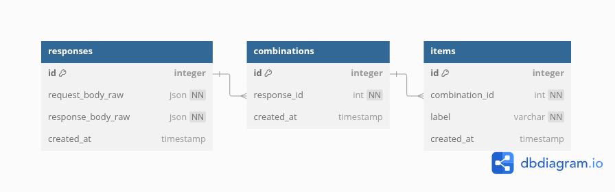

# k-multiset-combinations

REST API сервис для генерации комбинаторных сочетаний (k-комбинаций) из [мультимножеств](https://en.wikipedia.org/wiki/Multiset) с сохранением результатов в БД.

Проект разработан в рамках [тестового задания](./resources/assets/task.pdf).

## Features

* Реализация с использованием эффективного алгоритма поиска в глубину (DFS).
* Транзакционная вставка данных в MySQL через BULK INSERT с регулируемым BATCH_SIZE.
* Чистая архитектура сервиса, изолированность модулей, покрытие тестами.
* Готовые к использованию контейнеризация, CI/CD конвейер и Helm декларации для Kubernetes.

## Структура проекта

```bash
k-multiset-combinations/
├── __tests__/              # Тестовые сценарии
├── db/migrations/          # SQL миграции для базы данных
├── deployments/helm/       # Декларации Helm для запуска в Kubernetes
├── src/                   
│   ├── app/                # Точка входа: экспортирует основную функцию сервиса
│   ├── dtos/               # Структуры передачи данных с валидацией
│   ├── gateways/           # Контроллеры API
│   ├── library/            # Библиотека "чистых" функций
│   ├── repositories/       # Модуль работы с базой данных
│   └── services/           # Бизнес-логика приложения
│
├── scripts/                
│   └── migration.ts        # Управление миграциями базы данных
│
├── .env.test               # Переменные окружения для локального запуска
├── Dockerfile              # Инструкции для создания Docker-образа
├── docker-compose.yml      # Для запуска сервиса и окружения через docker-compose
├── start.sh                # Запуск миграций и основного сервиса 
├── .gitlab-ci.yml          # Конфигурация CI/CD пайплайна в GitLab
├── jest.config.ts          # Конфигурация для тестового фреймворка Jest
├── package.json            # Метаинформация о проекте и зависимости
└── tsconfig.json           # Конфигурация TypeScript
```

## Usage

## Database design

<center>



</center>

## Stack

* NestJS
* TypeScript
* mysql2

## Документация API

### POST /api/v1/generate
Генерация нового набора комбинаций

#### Параметры запроса (JSON):
| Поле         | Тип     | Обязательный | Описание                     |
|--------------|---------|--------------|------------------------------|
| `items`      | number[]  | да           | Мультимножество           |
| `length`   | number  | да           | Длина комбинации                       |

#### Пример запроса:
```http
POST /api/v1/generate HTTP/1.1
Content-Type: application/json
{
  "items": [1, 2, 1],
  "length": 2
}
```

#### Пример ответа:
```json
{
    "id": 1,
    "combination": [
        ["A1","B1"],
        ["A1","B2"],
        ["A1","C1"],
        ["B1","C1"],
        ["B2","C1"]
    ]
}
```

### GET /api/v1/status
Получение информации о состоянии сервиса

#### Пример запроса:
```http
GET /api/v1/status HTTP/1.1
```

#### Пример ответа:
```json
{
    "status": "ok",
    "uptime": 41686.426413128,
    "hostname": "k-multiset-combinations-55dc657d57-qwpvc",
    "timestamp": "2025-04-25T07:49:59.226Z",
    "commitHash": "283d431cf2f50eb7f2944607545751d8c827db0c"
}
```

## Комментарий к тестовому заданию

Поставленная задача относится к проблеме поиска k-комбинаций в [мультимножестве (multiset)](https://en.wikipedia.org/wiki/Multiset).

Поиск комбинаций заданной длины k в мультимножестве сводится к нахождению всех сочетаний типов длины [](#_) и перемножению их кратностей.

### Уточненная постановка задачи

Дано мультимножество:

<div align="center">

[](#_)

</div>

где [](#_) — количество элементов типа [](#_).  

**Требуется**: найти все подмножества [](#_) размера [](#_), где все элементы в [](#_) имеют **разные типы**.  

### Пример
Для `[1, 2, 1]` (типы `A, B, C`):  
- [](#_)  
- [](#_)  

<div align="center">

[![\\ {[A_1, B_1], [A_1, B_2], [A_1, C_1], [B_1, C_1], [B_2, C_1]}. \\  \\ ](https://latex.codecogs.com/svg.latex?%5C%5C%20%7B%5BA_1%2C%20B_1%5D%2C%20%5BA_1%2C%20B_2%5D%2C%20%5BA_1%2C%20C_1%5D%2C%20%5BB_1%2C%20C_1%5D%2C%20%5BB_2%2C%20C_1%5D%7D.%20%5C%5C%20%20%5C%5C%20)](#_)

</div>
